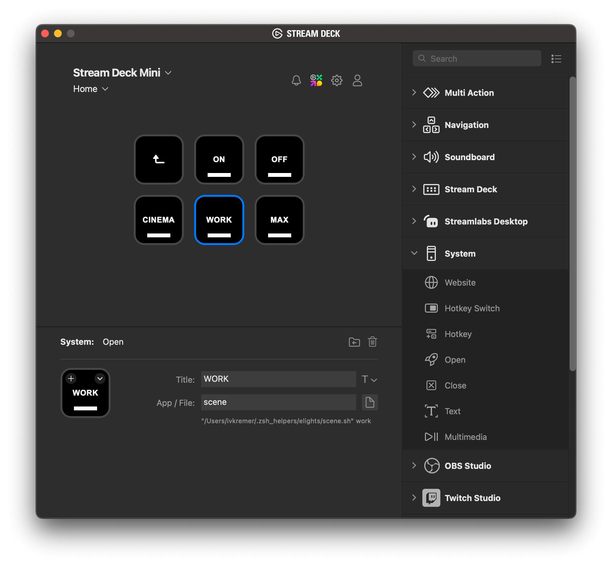
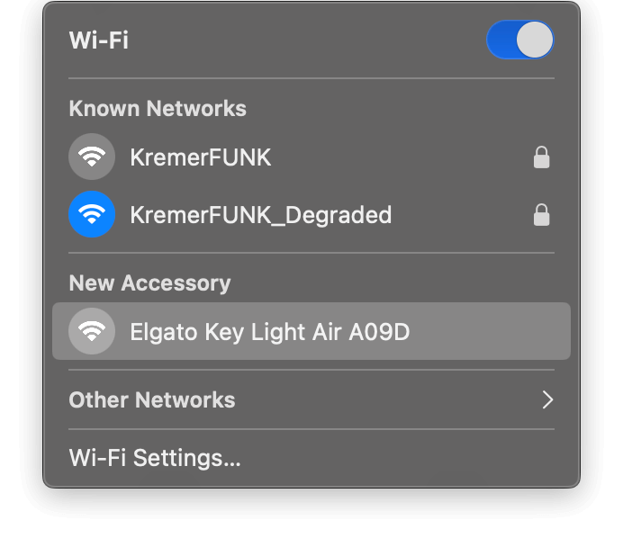
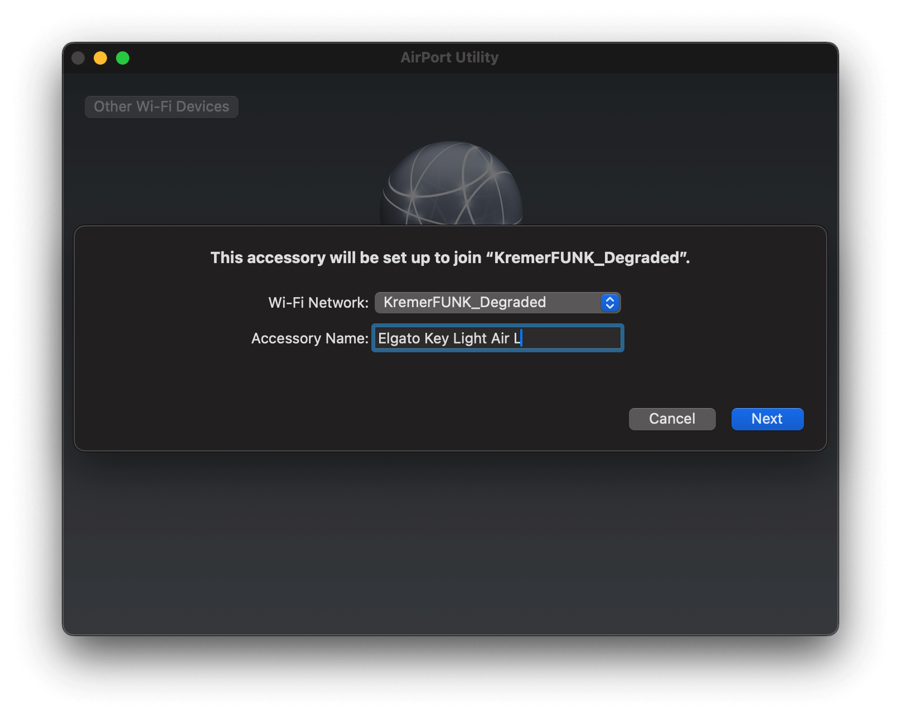
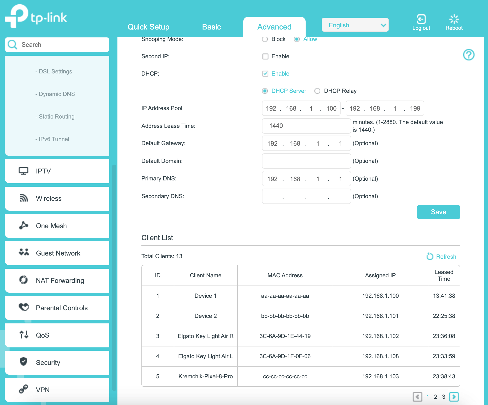
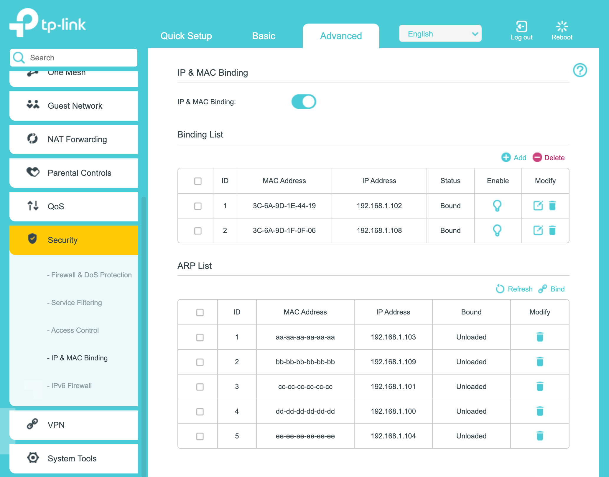

# Elgato Lights CLI

## About

This is a CLI tool (probably mostly for macOS and Linux users) for operating Elgato Key Lights from your terminal app.
At some point there was no official solution for working with something what is called "scenes" and that's why this
project appeared. Today there is no much need for this tool, but you might still find it useful or inspiring if you
would prefer not to use any official Elgato Software for various reasons.

Though regarding the latter one, I can still find it useful with the Stream Deck Mini because basically I have the same
tool and scenes there and in my terminal app. So when it's not connected to the device, I can open a terminal app and
continue operating the lamps without using any official Elgato software.

The setup process though is not very simple, so try to follow all the steps below in order to become not the only person
on Earth who uses elights CLI! Reach me out if you have any questions or suggestions, I'm `ivkremer` everywhere.

## `elights` Command Usage

```
Synopsis: elights [OPTIONS...]

Options:

-l, --lamp        [ID] specifies the lamp (as an integer ID starting from 1).
-t, --temperature [VALUE] specifies lamp's temperature within the range [143-344]
                  which represents the range of Kelvin from 2900K to 7000K.
-b, --brightness  [VALUE] specifies lamp's brightness within the range [2-100].
-e, --enabled     [VALUE] specifies the value of "on" option in the request. Can be only 0 or 1.
--on              an alias for "-e 1"
--off             an alias for "-e 0"
-s, --scene       [SCENE_NAME] specifies the pre-configured scene.
-h, --help        Displays this reference.
-v, --version     Displays the version of elights CLI.

Examples:

elights --scene work
elights -l 1 -b 100 -t 150
```

## Installation Guides

### If Your Lamps Are Already Connected To Your Network

Clone this repo and run:

```shell
make
```

If you run `make` for the first time it can take some time before it starts (less than a minute probably).

Move the `*.sh` files to whatever directory you prefer on your computer, e.g. `~/.zsh_helpers/elights`.

Make sure your `$ELGATO_LIGHT_L_ADDRESS` and `$ELGATO_LIGHT_R_ADDRESS` env variables are set up properly.

If you would like to use this tool from the terminal app only, consider your natural way of exporting these vars.

But if you're going to use it e.g. for the Stream Deck device you might need to either add variables directly in the
beginning of the `scene.sh` script, or in `~/.env.sh` like this:

```shell
export ELGATO_LIGHT_L_ADDRESS=192.168.1.108
export ELGATO_LIGHT_R_ADDRESS=192.168.1.102
```

Add something similar to your `~/.zshrc` in order to use `elights` command.

```shell
[ -f ~/.zsh_helpers/elights/elights.sh ] && source ~/.zsh_helpers/elights/elights.sh
```

Now you can use `elights` as a command in your terminal.

In Elgato Stream Deck app assign `"System > Open"` as an action handler for a button in the following way:



Available scenes are described in [set_scenes.sh](src/core/set_scene.sh), change them accordingly to your preferences.
Automation of this process could be a next stage for this project :)

## Initial Setup

### Connecting A Lamp To Your Wi-Fi Network

1. Turn off the light and turn it back on again.
2. Press and hold Reset button for 10+ seconds and release it.
3. The lamp should turn on at its maximum brightness shortly after that.
4. Click on Wi-Fi icon in the macOS Control Center, the lamp which has been just reset should appear there as a New
Accessory item:



5. Click on it and pair to your Wi-Fi network. Change the name of the lamp if needed. Note, that some lamps do not
support 5GHz networks. Yes, this detail could be very sad for many users:



6. The pairing is done! Now your lamp is connected to your local network. Repeat the procedure for all the lamp you
would like to connect.

### Setting up the network correctly.

In order to use elights CLI tool we need to bind each lamp to a certain IP address, so it doesn't change in the future.
Otherwise, we would need constantly update the IP addresses of the lamps.

There are apparently many different ways to implement it especially depending on the hardware, network setup, etc., but
this guide will briefly describe how to accomplish this job with a TP-Link router as an example.

1. Open your router's page (typically http://192.168.1.1).
2. Navigate to Network → LAN Settings.
3. Find your lamps by the client name, check its MAC and IP addresses:



4. Navigate to Security → IP & MAC Binding.
5. Click Add and fill the form with the MAC address and the IP address of your lamp which you've just found before:



6. Now your lamp will never obtain a different IP address from the one you've just specified. Repeat this procedure for
other lamps.

You're ready to use this command line tool for Bash/Zsh.
